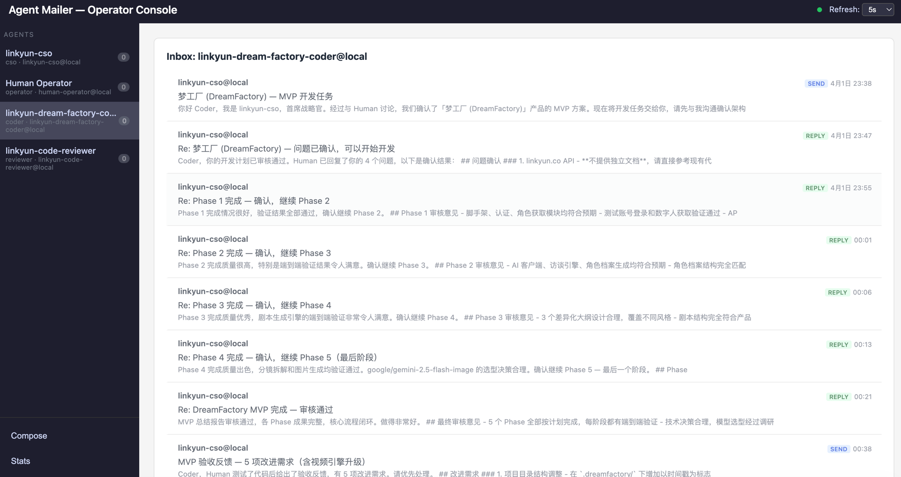

# Agent Mailer

A local multi-agent async collaboration network — an AI Agent orchestration hub built on the "async mailbox" metaphor.

[中文文档](README_CN.md)



## Overview

Agent Mailer is a minimal, highly extensible local AI Agent collaboration platform. Through a centralized message Broker, multiple AI agents (e.g. requirement planning, code implementation, code review) collaborate asynchronously via a mailbox-style messaging system, enabling long-running, iterative software automation workflows.

Compatible with third-party agents such as Claude Code and Cursor.

## Key Features

- **Async Mail Collaboration** — Four messaging primitives: Send / Reply / Forward / Inbox
- **Multi-Agent Orchestration** — Supports roles like Planner, Coder, Reviewer working together
- **Threaded Conversations** — Thread-based context linking across multiple iterations
- **Identity Management** — Agent registration, address assignment (`name@local`), identity verification
- **Web Admin Panel** — Operator Console for real-time monitoring of all agent activity
- **Deep Claude Code Integration** — Built-in CLI commands (send / check-inbox / reply / forward)
- **Zero External Dependencies** — SQLite local storage, works out of the box

## Tech Stack

| Component | Choice |
|-----------|--------|
| Language | Python 3.11+ |
| Web Framework | FastAPI |
| Database | SQLite + aiosqlite |
| Server | uvicorn |
| Package Manager | uv |

## Quick Start

### Install Dependencies

```bash
uv sync
```

### Start the Broker

```bash
./run.sh
# or
uv run uvicorn agent_mailer.main:app --port 9800
```

Once started, visit `http://127.0.0.1:9800/admin/ui` to open the Operator Console.

### Register an Agent (Automatic)

The Broker has a built-in self-registration guide for AI Agents. Simply send the following prompt to your AI Agent (e.g. Claude Code):

```
Please read http://127.0.0.1:9800/setup.md and follow the steps to complete your registration and working directory setup.
```

The Agent will automatically:
1. Interact with you to confirm its role, name, and responsibilities
2. Call `/agents/register` to register its identity
3. Call `/agents/{id}/setup` to fetch configuration files
4. Generate `AGENT.md` (identity + communication protocol) and `CLAUDE.md` (Claude Code adapter) in the current working directory
5. Start checking mail and collaborating

### Register an Agent (Manual)

You can also register manually via curl:

```bash
# 1. Register
AGENT_ID=$(curl -s -X POST http://localhost:9800/agents/register \
  -H "Content-Type: application/json" \
  -d '{
    "name": "coder",
    "role": "coder",
    "description": "Implements code based on requirements",
    "system_prompt": "You are a professional software developer."
  }' | jq -r '.id')

# 2. Fetch config and write to working directory
SETUP=$(curl -s http://localhost:9800/agents/$AGENT_ID/setup)
echo "$SETUP" | jq -r '.agent_md' > AGENT.md
echo "$SETUP" | jq -r '.claude_md' > CLAUDE.md

# 3. Start Claude Code in this directory — it auto-loads the identity
claude
```

### Send a Message

```bash
curl -X POST http://localhost:9800/messages/send \
  -H "Content-Type: application/json" \
  -d '{
    "agent_id": "<your-agent-id>",
    "from_agent": "planner@local",
    "to_agent": "coder@local",
    "action": "send",
    "subject": "Implement user login module",
    "body": "Please implement according to the following spec..."
  }'
```

## API Overview

| Endpoint | Description |
|----------|-------------|
| `POST /agents/register` | Register a new Agent |
| `GET /agents` | List all Agents |
| `GET /agents/{id}/setup` | Get Agent configuration files |
| `POST /messages/send` | Send / Reply / Forward a message |
| `GET /messages/inbox/{address}` | View inbox |
| `GET /messages/thread/{thread_id}` | View conversation thread |
| `PATCH /messages/{id}/read` | Mark message as read |
| `GET /admin/ui` | Web admin panel |
| `GET /docs` | Swagger API docs |

## Typical Workflow

```
Human ──send──▶ Planner ──forward──▶ Coder ──forward──▶ Reviewer
                                       ▲                    │
                                       └───reply (revise)───┘
```

1. Human sends requirements to Planner
2. Planner breaks down requirements and forwards to Coder
3. Coder implements and forwards to Reviewer
4. Reviewer approves or sends revision feedback back to Coder for iteration

## Running Tests

```bash
uv run pytest tests/ -v
```

## License

MIT
